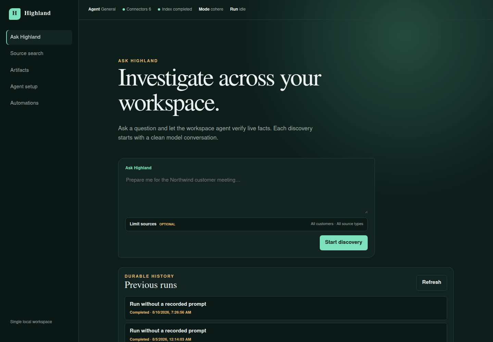
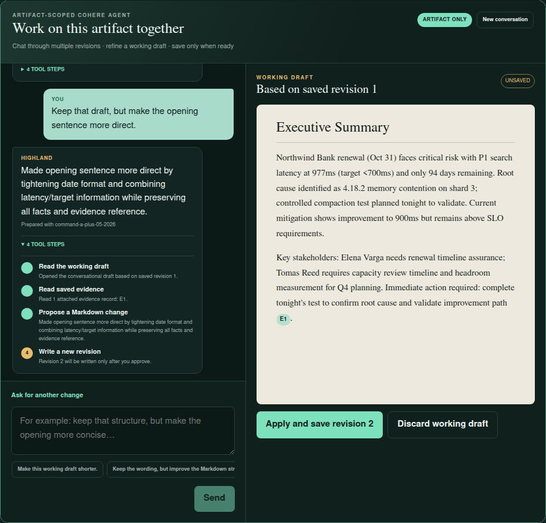
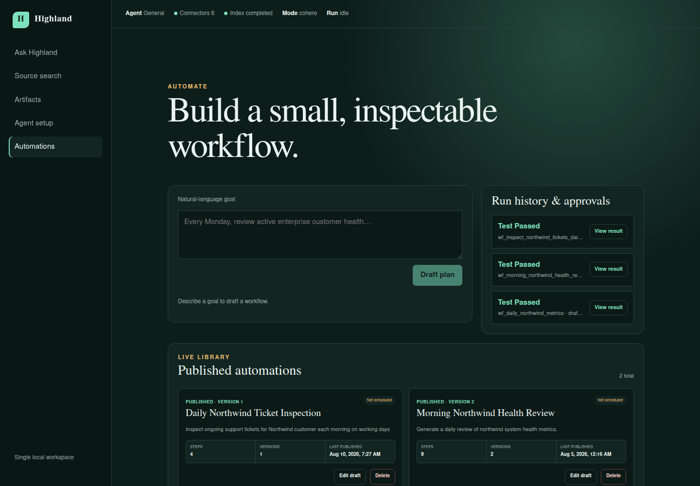

# Highland: Introduction

## Why I Built Highland

I have found all the recent developments in the software industry fascinating. We are entering a new world of software that revolves around building harnesses around models to automate tasks. You can see this in OpenClaw and in coding assistants such as Codex and Claude, as well as in the many other assistants being built to help people automate their work.

At the same time, many software engineers still spend most of their time working on deterministic backends and frontends and have not yet had the opportunity to work with models and automation. I have been experimenting with these technologies and learning about them for a while, and that made me stop and think: what if I tried to teach people what I know in a simple way?

I wanted to abstract away much of the heavy machine-learning and AI detail and provide a set of high-level concepts that software engineers can understand. But abstractions and articles on their own do not always help enough. Nothing beats hands-on learning.

This is when I decided to build a project that simulates an agentic platform. I want to use the project and its code to show what such a platform does, how it does it, how to build a harness around a model, and how the different parts of the stack fit together, from retrieval and grounding to tool use, evaluation, and automation. This is what Project Highland is about and why I built it.

## The Demo: Summit Software and Northwind Bank

Highland is an educational agentic platform. The project simulates a software company, **Summit Software**, using this platform to automate tasks that would otherwise require a lot of human effort to collect information from many places, bring it together, and verify that it is correct.

Like a real software company, Summit Software keeps different kinds of information in different systems:

| System | Fictional product | What it contains |
| --- | --- | --- |
| CRM | **Atlas CRM** | Customers, contacts, and commercial context |
| Knowledge base | **Archive** | Product documentation, architecture notes, and runbooks |
| Customer support | **Relay Desk** | Support tickets and their comments |
| Observability | **Beacon** | Deployments, incidents, and time-series metrics |
| Communications | **Pulse** | Messages, meetings, and customer updates |
| Project management | **Track** | Engineering and customer-success work items |

For the purpose of this demo, one of Summit Software's customers is **Northwind Bank**. Facts about Northwind are deliberately spread across all these systems. Throughout the tutorial, you will see how the company can use Highland to automate tasks related to this customer and its interactions with them. For example, it can investigate an issue, prepare for a meeting, create a briefing, or run a recurring customer-health workflow.

## Design Choices and Trade-offs

There are a few assumptions and deliberate trade-offs behind this project that are worth explaining before we start.

### A vibe-coded learning project

First, the project is largely vibe-coded, and I know that the code might not be optimal in some places. There are parts I did not care about as much and barely inspected, such as the frontend code. The frontend is not what I am trying to teach; it is a means to an end.

There are other parts where I was much more interested in how things were implemented, so I steered the model and reviewed the approach more closely. Even then, the code might not always be the most optimized or production-ready implementation. It serves the purpose of the project: showing the concepts I want to demonstrate in a working system.

### Mock systems that behave like real integrations

Because this is a simulation, I created a lot of synthetic data, hid it behind separate systems, and exposed those systems through APIs. They all run locally, but the boundaries between them are intentional and simulate real-world integrations.

In theory, the dataset is small enough that I could put all of it into a single model call. It would fit in the context window, make the code much shorter, and probably produce similar outputs. But that would not simulate a real-world scenario.

In the real world, data is usually hidden behind different systems that you need to invoke, or there is simply too much data to place all of it into the model context. You need to find the relevant information, retrieve only what is useful, and pass that information to the model. Highland keeps those constraints even though its dataset is small, because those are the mechanics the project is meant to teach.

### A one-key setup

I also wanted the demo to be very easy to set up and run. It uses models for embeddings, reranking, reasoning, and tool calling, so asking people to configure several providers would make it harder to get started.

Cohere provides the full set of capabilities needed for this demo. Its trial API keys are currently free but rate-limited, which makes them suitable for learning and experimentation; you should still check [Cohere's current trial-key limits](https://docs.cohere.com/v2/docs/rate-limits) before starting.

I built two bootstrap scripts for this, both located in the root of the project directory. On Linux or macOS, run:

```bash
./bootstrap.sh
```

On Windows, run the PowerShell version:

```powershell
./bootstrap.ps1
```

The guided setup asks you for a Cohere API key, stores it in the project's local configuration, and starts the complete Highland environment. Once you have created an account and copied a trial key, you can paste it into the prompt and follow the whole flow without having to configure each part separately.

### Cohere-specific by design

Because I use the Cohere stack, I also use some of its SDKs directly. Normally, when I implement a side project, I try to avoid vendor lock-in. I might hide models behind something such as LiteLLM or another proxy so that I can change the model or provider later. I also like using OpenRouter because it gives me access to many models without requiring changes throughout the code.

For this demo, however, I deliberately rely on Cohere's models and SDKs. Supporting several interchangeable providers would add another layer of abstraction and more code, while the purpose here is to make the agentic stack easier to follow. This is a trade-off made specifically for the demo and tutorial.

### An interface optimized for learning

Some of the output you see in the UI is also optimized for demonstration. In several places, Highland displays the whole model run: which data it retrieved, which tools the model called, and the input and output of every tool.

You probably would not expose all this detail to an end user in a real product. I expose it here because I want people to understand the agentic loop and tool calling: what the software gives the model, what the model returns, how the software executes a requested action, and how the result goes back to the model.

### Single-shot discovery, focused conversations

I made discovery and search single-shot experiences. This is a simplification. In a real product, you would probably continue the conversation, inspect the result, and ask the model to do more work.

For this use case, I felt that follow-up conversation was not necessary to teach the core mechanics. A single run is enough to see how the model approaches a question, how the agentic loop works, and how retrieval and tools contribute to the answer. I omitted multi-turn discovery to keep that part of the project focused.

I kept multi-turn conversation support in the **Artifacts** section instead. There, you can generate an artifact and then continue working with the model in a chat experience to revise it. This gives us one focused place to explore how conversations work without adding that complexity to every part of the application.

## A Quick Look at Highland

The **Ask Highland** workspace is where a user can start an investigation across the connected systems and inspect previous runs.



The **Artifacts** workspace turns grounded answers into reusable documents and lets the user refine a working draft through a focused conversation with the model.



The **Automations** workspace turns a natural-language goal into an inspectable workflow, with test runs, approvals, versioned publishing, and scheduling kept visible.


