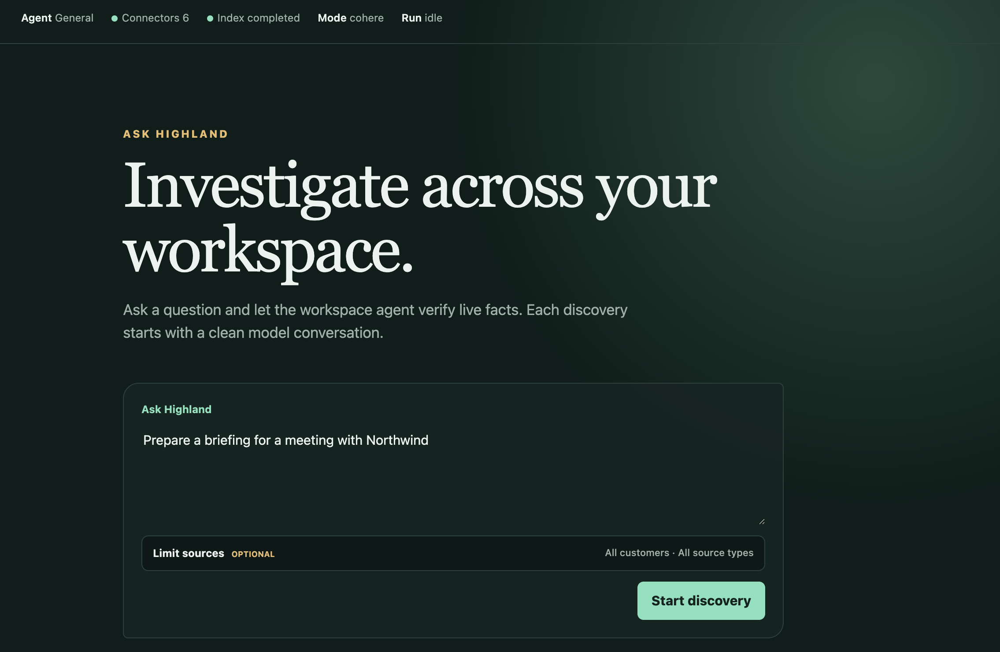
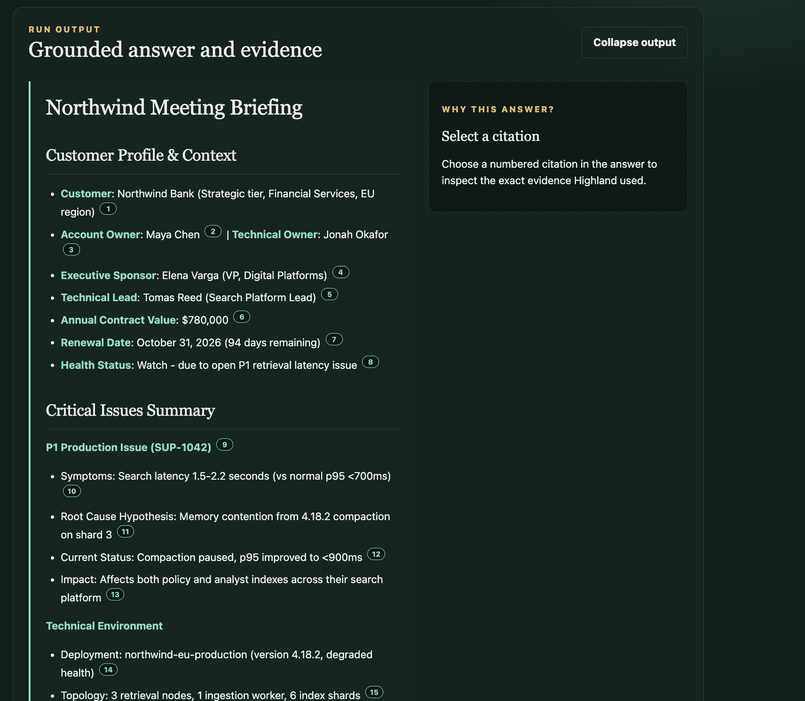
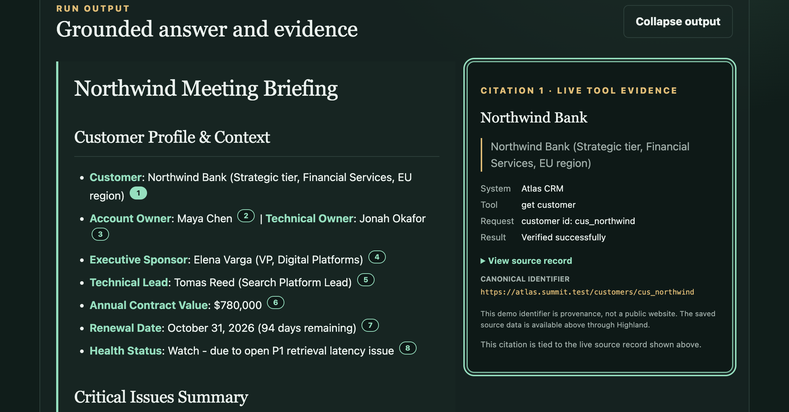
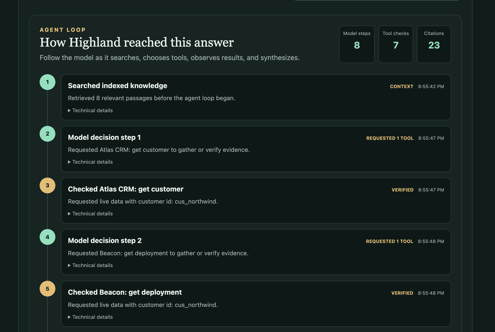

# Highland: Discovery

## From a Question to a Grounded Answer

Discovery is the first agentic workflow I want to cover. In Highland, discovery combines retrieval, tool use, and an agent loop to investigate a question and produce a grounded answer. In enterprise knowledge work, the difficult part is not simply generating fluent text. It is finding the right evidence and grounding the answer in correct, relevant data.

A large language model can generate convincing content, but in this situation, we do not want it to invent facts. We want Highland to retrieve useful indexed knowledge, let the model gather live information through tools, and make the result transparent. The user should be able to see where each claim came from and how the model reached the answer.

I will start by showing how discovery looks in the UI, then walk through the core code path. A later tutorial will focus specifically on retrieval itself: chunking, indexing, embeddings, and hybrid retrieval.

## User Experience

### Asking Highland

Imagine that you work at Summit Software and are about to meet with Northwind Bank. Information about the customer is spread across several systems, and you want to understand what is happening before the meeting. A simple way to begin is to ask Highland to prepare a briefing:



After you select **Start discovery**, Highland begins the run. It searches for relevant knowledge, asks the model what other information it needs, calls the appropriate tools, and gradually builds an answer. This takes a little time because Highland is gathering and verifying evidence rather than asking the model to answer from memory alone.

### Inspecting the Grounded Answer

When the run finishes, Highland displays the generated briefing:



Many statements in the answer have numbered citations. Selecting one opens the evidence panel and shows the exact information behind that statement:



The citation tells us which system Highland queried, which tool it called, what it requested, and which source record supports the claim. This makes the answer easier to inspect instead of asking the user to trust a block of generated text.

### Following the Agent Loop

If you scroll farther down, you can inspect the agent loop: the sequence of model decisions, tool calls, and tool results that produced the answer. A typical product would keep this process hidden, but Highland exposes it for educational purposes so that the model's decision-making is easier to understand. The snapshot below shows a subset of the steps.



The summary shows **8 model steps**, **7 tool checks**, and **23 citations**. These numbers describe the actual run.

Before the agent loop began, Highland searched its index and retrieved eight relevant passages. These gave the model an initial set of background information. The model then entered a repeated cycle: review the available context, decide what was still missing, request a tool, observe the result, and decide what to do next.

Across the run, the model called **Atlas CRM** for customer and account context, **Beacon** for deployment details and to check for incidents, **Pulse** for recent communications, **Relay Desk** for support tickets, and **Track** for related project issues. The model chose each tool as the previous result revealed another area that could help complete or verify the briefing.

The seven tool checks were therefore not a predefined workflow. They emerged from the model's decisions during the run. After each tool result was added to its context, the model evaluated whether it had enough evidence or needed another source. On the eighth model step, it requested no more tools and synthesized the final briefing. Highland then connected the answer to the supporting indexed passages and live tool results through 23 citations, leaving a visible chain of evidence behind it.

## Technical Deep Dive

The backend entry point for **Start discovery** is the [`chat` method in `DiscoverService`](../src/highland/discover/service.py#L210). I will focus on the shortest path through this method and the agent loop. How the index is built, tool validation and approvals, and session or event storage are all important, but they are outside the core flow I want to explain here.

### 1. Retrieve the Initial Context

The first step is to search the existing index with the user's query:

```python
retrieval = await self.search(request)
```

I will cover chunking, indexing, embeddings, and hybrid retrieval in a separate tutorial. For now, the important point is that the search returns a ranked collection of relevant chunks. Here is a shortened version of the [captured retrieval response](data/1-discovery/retrieval-response.txt):

```text
RetrievalResponse(
    query="Prepare a briefing for a meeting with Northwind",
    results=[
        RetrievalResult(
            chunk=Chunk(
                id="chk_d856...",
                source_system="archive",
                title="Northwind Bank 2026 success plan",
                text="Summit will deliver a capacity review before August 7...",
            ),
            score=0.605,
        ),
        RetrievalResult(
            chunk=Chunk(
                id="chk_7f45...",
                source_system="pulse",
                title="Northwind weekly deployment review",
                text="Northwind approved the 4.18.2 maintenance window...",
            ),
            score=0.602,
        ),
        ...
    ],
)
```

The real response also contains retrieval diagnostics and timing information, but the chunks and their scores are what matter for this flow.

### 2. Turn the Chunks into Documents

The method then converts each retrieved chunk into a `Document`. The text becomes the content that the model can read, while the metadata preserves where that content came from:

```python
documents = [
    Document(
        id=result.chunk.id,
        text=result.chunk.text,
        metadata={
            "source_system": result.chunk.source_system,
            "source_id": result.chunk.source_id,
            "source_url": result.chunk.source_url,
            "source_type": result.chunk.source_type,
            "customer_id": result.chunk.customer_id,
            "section": result.chunk.location.section,
        },
    )
    for result in retrieval.results
]
```

A shortened item from the [captured `documents` list](data/1-discovery/documents.txt) looks like this:

```text
Document(
    id="chk_d856...",
    text="Summit will deliver a capacity review before August 7...",
    metadata={
        "source_system": "archive",
        "source_id": "doc_northwind_success_plan",
        "section": "Open success actions",
    },
)
```

This conversion gives the model the relevant text and gives Highland the identifiers it will later need for citations.

### 3. Start the Agent Loop

Next, Highland starts the MCP gateway. The gateway exposes the tools the model can use to retrieve live information or perform an action. I cover how that discovery and tool-calling path works in the [MCP and tool use tutorial](3-mcp-tools.md), so the only important detail here is that the tools are available before the loop starts:

```python
gateway = MCPGateway(
    self.connector_commands,
    startup_timeout_seconds=self.connector_timeout_seconds,
    request_timeout_seconds=self.connector_timeout_seconds,
)
await gateway.start()
```

The method then passes the user's message and the retrieved documents into the [`AgentLoop`](../src/highland/runtime/agent.py#L163):

```python
outcome = await loop.run(
    run_id=run_id,
    user_message=request.query,
    documents=documents,
    prior_messages=prior_messages,
    scope=RunScope(...),
)
```

This is the core handoff: retrieval supplies the initial documents, and the agent loop decides whether those documents are enough or whether it needs to call tools for more information.

### 4. Decide, Act, and Observe

The agent uses a simple ReAct-style pattern: the model decides what to do, Highland executes the requested action, and the result becomes new context for the model. The loop is bounded so that it cannot continue forever:

```python
for step in range(1, self.profile.budgets.max_steps + 1):
```

On each step, Highland creates a chat request containing the conversation, the available tools, and the documents retrieved earlier, and then sends it to the model:

```python
request = ChatRequest(
    messages=self._bounded_messages(state.messages),
    tools=self.tools.model_tools(scope),
    documents=documents or [],
)

response = await self.model.chat(request)
```

The [captured first request](data/1-discovery/chat-request.txt) contains all three parts:

```text
ChatRequest(
    messages=[
        Message(role="system", content="You are Highland's enterprise workspace agent..."),
        Message(role="user", content="Prepare a briefing for a meeting with Northwind"),
    ],
    tools=[..., ToolDefinition(name="crm__get_customer"), ...],
    documents=[Document(id="chk_d856..."), Document(id="chk_7f45..."), ...],
)
```

The model can either return the final answer or request one or more tools. In the [first response from this run](data/1-discovery/chat-response.txt), it chose a tool:

```text
ChatResponse(
    message=Message(
        role="assistant",
        content="",
        tool_calls=[
            ToolCall(
                name="crm__get_customer",
                arguments={"customer_id": "cus_northwind"},
            )
        ],
    ),
    finish_reason="tool_call",
)
```

Highland executes the requested tools. The surrounding code validates permissions and handles approvals, but I am intentionally leaving that out here so we can stay focused on the loop itself:

```python
executed = await asyncio.gather(
    *(self.tools.execute(checked) for _, checked in validated)
)
```

The results are appended to the conversation as a tool message:

```python
state.messages.append(
    Message(role=MessageRole.TOOL, tool_results=tool_results)
)
```

In the [captured conversation after the first tool call](data/1-discovery/messages-with-tool-results.txt), the important additions look like this:

```text
Message(
    role="assistant",
    tool_calls=[ToolCall(name="crm__get_customer", ...)],
)
Message(
    role="tool",
    tool_results=[
        ToolResult(
            tool_call_id="crm__get_customer_fhvzyts1zf7p",
            content='{"name": "Northwind Bank", ...}',
        )
    ],
)
```

The next iteration sends this updated conversation back to the model. The same cycle continues: the model sees what it already knows, decides whether it needs another tool, and observes the next result.

### 5. Return the Answer and Its Citations

When the model returns content without requesting another tool, the loop is complete. Leaving out the persistence and trace code, the completion path is essentially:

```python
if not response.message.tool_calls:
    return RunOutcome(
        run_id=run_id,
        status=RunStatus.COMPLETED,
        content=response.message.content,
        finish_reason=response.finish_reason,
        citations=response.citations,
        usage=state.usage,
    )
```

There are two related objects here. The model's [final `ChatResponse`](data/1-discovery/final-chat-response.txt) has a `complete` finish reason and contains the generated answer and citations. The loop then wraps those values in the final [completed `RunOutcome`](data/1-discovery/outcome.txt), which is what `DiscoverService.chat()` returns.

The citations are especially important. A citation can point to a live tool result through `tool_call_ids`:

```text
Citation(
    start=66,
    end=80,
    text="Northwind Bank",
    source_ids=[],
    tool_call_ids=["crm__get_customer_fhvzyts1zf7p"],
)
```

Or it can point back to one of the original retrieved documents through `source_ids`:

```text
Citation(
    start=1538,
    end=1636,
    text="Capacity review delivery, Q4 ingestion forecast confirmation, "
         "latency SLO agreement before renewal",
    source_ids=["chk_d8566b99ad81ca969bc4d8d9"],
    tool_call_ids=[],
)
```

Cohere returns these citations as part of the model response, including the span of answer text and the sources that support it. Highland preserves those references so the UI can connect each claim to either an indexed document or a tool result.

That is the complete discovery path in its simplest form: retrieve relevant chunks, turn them into documents, give those documents and the available tools to the model, execute any requested tools, and repeat until the model returns a final answer with citations.
