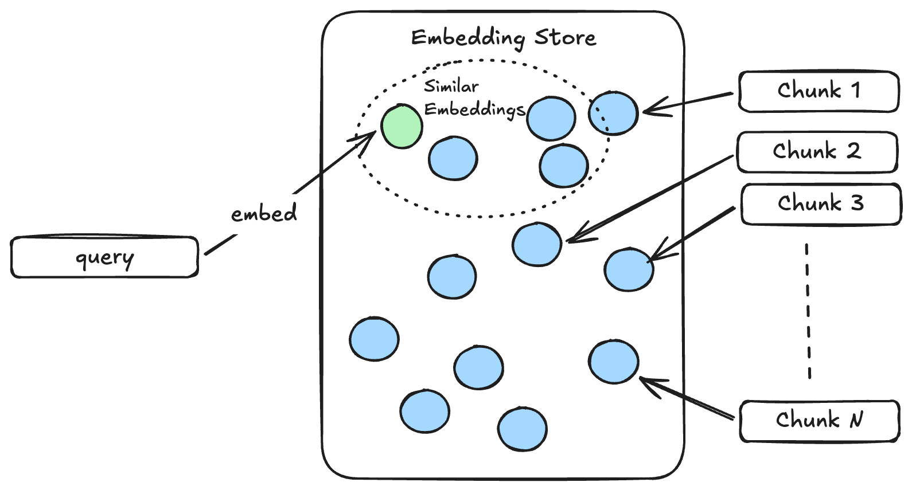

# Highland: Retrieval

## Finding the Right Context

In the previous tutorial, I showed the whole discovery stack: retrieval, MCP tools, and the agent loop working together to produce a grounded answer. In this tutorial, I want to go deeper into the retrieval part and explain how Highland finds the information that it gives to the model.

When a user asks Highland a question, the platform may have access to far more information than can or should be placed in one model request. The goal of retrieval is to search that knowledge and select the small portion that is most relevant to the query. The model can then use that context to reason about the request, decide which tools to call, and produce a grounded answer.

Retrieval quality therefore matters a great deal. If we retrieve irrelevant information, the model has to reason through noise. If we miss an important source, the model may not have the evidence it needs. A good retrieval system tries to maximize useful context while keeping the final set of documents small enough for the model to work with effectively.

I will use the same example from the discovery tutorial. The user asks Highland to **prepare a briefing for a meeting with Northwind Bank**. If the knowledge base contains many documents, how do we find the few passages that matter for that meeting?

Highland uses a hybrid approach:

1. Split source documents into smaller chunks.
2. Search those chunks by exact words with a lexical index.
3. Search them by meaning with an embedding index.
4. Combine both rankings with reciprocal rank fusion.
5. Ask a reranking model to select the best final results.

Some of this work happens when the index is built, before a user searches. The rest happens at query time. Keeping that distinction in mind makes the pipeline easier to follow.

## Technical Deep Dive

### 1. Split Documents into Chunks

Before Highland can search anything, it has to turn the records from its source systems into searchable units. A whole support ticket, incident, or knowledge-base article may contain several different ideas. Creating one embedding for the entire document would blur those ideas together, and returning the entire document could add a lot of irrelevant text to the model's context.

Highland therefore breaks each `SourceDocument` into `Chunk` objects. The real [`chunk_document` function](../src/highland/retrieval/contracts.py#L183) first looks for meaningful boundaries such as explicit source passages, Markdown headings, and paragraphs. If one of those sections is still too large, it splits the text at sentence boundaries and keeps each part below the configured size.

Here is a simplified version of that process:

```python
def chunk_document(document, max_chars=1800):
    chunks = []

    for section, body in semantic_sections(document):
        for part in bounded_parts(body, max_chars=max_chars):
            chunks.append(
                Chunk.from_document(
                    document,
                    text=part,
                    section=section,
                    ordinal=len(chunks),
                )
            )

    return chunks
```

The default limit is 1,800 characters, but Highland does not blindly cut every document at that exact position. It tries to preserve the source's structure first. That gives each chunk enough surrounding context to remain understandable while keeping it focused on one part of the document.

Each chunk also keeps the metadata Highland will need later: the source system, source record ID, title, section, visibility, customer, update time, and URL. The [`Chunk.from_document` method](../src/highland/retrieval/contracts.py#L56) creates a stable chunk ID from the source identity and content. This is what allows a retrieved passage to be traced back to its original source and eventually shown as a citation.

During ingestion, Highland normalizes records from the different systems and chunks all of the resulting documents. The complete flow is in [`BackfillService.backfill`](../src/highland/retrieval/ingestion.py#L140); the central step is simply:

```python
chunks = [
    chunk
    for document in documents
    for chunk in chunk_document(document)
]
```

Those same chunks are used by both the lexical and embedding searches, so the two retrieval strategies can return compatible chunk IDs.

### 2. Find Exact Terms with the Lexical Index

The simplest way to search the chunks is to look for the words in the user's query. In our example, **Northwind** is a particularly useful term. A lexical search can find chunks whose title, text, source ID, or record key contains that word.

Highland implements this in [`LexicalIndex`](../src/highland/retrieval/hybrid.py#L67). It tokenizes the searchable text, counts how often each term appears in a chunk, and records how common each term is across all chunks. At query time, it applies a small BM25-style scoring function:

```python
for chunk, terms in zip(self.chunks, self.terms):
    score = 0.0

    for term in tokens(query):
        frequency = terms.count(term)
        if not frequency:
            continue

        frequency_weight = bm25_frequency_weight(frequency, len(terms))
        inverse_frequency = inverse_document_frequency(term)
        score += frequency_weight * inverse_frequency

    if score:
        matches.append((chunk.id, score))

return sorted(matches, key=highest_score_first)[:limit]
```

The important idea is that a match is more useful when the term appears in the chunk but is relatively uncommon across the whole collection. Highland does not explicitly remove common words as stop words. Instead, the inverse-document-frequency part of the score naturally gives very common terms less influence. The calculation also accounts for chunk length so that a long chunk does not win merely because it contains more words.

This implementation is intentionally small and self-contained so that the retrieval mechanics remain visible to someone reading the project. In a production system, a team would often use a mature search engine such as Elasticsearch, OpenSearch, or another Lucene-based service. Those systems provide much more sophisticated indexing, language analysis, scaling, and operational behavior. Highland keeps the local implementation because its purpose is to teach the concept.

Lexical retrieval is excellent for names, identifiers, product terms, error codes, and exact phrases. Its limitation is that the words have to overlap. A relevant passage can express the same idea as the query without using the same vocabulary. That leads us to semantic search.

### 3. Find Similar Meaning with the Embedding Index

An embedding is a numerical representation of text. An embedding model has learned patterns from a large amount of language and can map text to a vector: an array of numbers whose position captures aspects of the text's meaning. Texts with similar meanings tend to produce vectors that are close together, even when they do not use exactly the same words.

When Highland builds the index, the [`EmbeddingIndex.embed_chunks` method](../src/highland/retrieval/faiss_store.py#L155) sends the chunk text to the embedding model in batches. Notice that it labels these inputs as search documents:

```python
response = await embedding_model.embed(
    EmbeddingRequest(
        texts=[chunk.text for chunk in batch],
        input_type=InputType.SEARCH_DOCUMENT,
    )
)

vectors_by_id.update(
    zip((chunk.id for chunk in batch), response.vectors)
)
```

Highland stores the resulting vectors in a local [`FaissStore`](../src/highland/retrieval/faiss_store.py#L32), together with a mapping from each vector back to its chunk ID. This work happens ahead of time when the index is built or synchronized; the user does not wait for every document to be embedded on every search.

At query time, the [`EmbeddingIndex.query` method](../src/highland/retrieval/faiss_store.py#L205) embeds only the user's query, this time using the search-query input type, and searches the existing FAISS index:

```python
response = await embedding_model.embed(
    EmbeddingRequest(
        texts=[query],
        input_type=InputType.SEARCH_QUERY,
    )
)

matches = vector_store.search(response.vectors[0], limit=limit)
```

The diagram below shows this query-time path. Every blue point represents a chunk embedding that was prepared earlier. Highland embeds the query as the green point and retrieves the chunk vectors closest to it.



The vector size depends on the embedding model. Highland uses Cohere's `embed-v4.0` by default and FAISS as the local vector store because it is simple to run as part of this educational project. The [`FaissStore.add` and `search` methods](../src/highland/retrieval/faiss_store.py#L75) normalize both document and query vectors, then use an inner-product index. For normalized vectors, that inner product corresponds to cosine similarity, so higher scores indicate vectors pointing in more similar directions.

In a larger production system, the embedding index might live in a dedicated vector database or a search platform with vector support. The underlying idea remains the same: embed the chunks ahead of time, embed the query when it arrives, and retrieve nearby vectors by similarity.

Semantic retrieval can find a passage about **preparing customer context before a meeting** even if that passage never uses the word **briefing**. Its limitation is the other side of the lexical trade-off: an approximate semantic match may miss the importance of an exact customer name or record key. Highland uses both strategies rather than forcing one to solve every kind of query.

### 4. Combine the Rankings with Reciprocal Rank Fusion

At query time, [`HybridRetriever.search`](../src/highland/retrieval/hybrid.py#L177) asks the lexical index and embedding index for candidates independently:

```python
lexical = self.lexical.search(query, limit=self.candidate_limit)

semantic_matches = await self.embedding_index.query(
    self.vector_store,
    query,
    limit=self.candidate_limit,
)
semantic = [(match.chunk_id, match.score) for match in semantic_matches]
```

We now have two ranked lists, but their raw scores mean different things. A BM25-style lexical score cannot be compared directly with a vector-similarity score. Adding or averaging those values would make the result depend on two unrelated scoring scales.

Highland instead uses [`reciprocal_rank_fusion`](../src/highland/retrieval/hybrid.py#L120), usually shortened to RRF. RRF pays attention to where a chunk appears in each list rather than comparing the raw scores:

```python
for ranking in (lexical, semantic):
    for rank, (chunk_id, _score) in enumerate(ranking, start=1):
        fused_scores[chunk_id] += 1 / (60 + rank)

ordered = sorted(
    fused_scores,
    key=lambda chunk_id: fused_scores[chunk_id],
    reverse=True,
)
```

A chunk receives a contribution for every ranking in which it appears. Results near the top contribute more, and a chunk that performs well in both searches becomes especially strong. The constant `60` softens the difference between nearby positions so that one first-place result does not overwhelm the rest of the candidate set.

This gives Highland one combined ordering that benefits from both exact matches and semantic similarity without pretending that the two original scores are directly comparable.

### 5. Filter and Rerank the Candidates

The fused list is still a candidate list, not the final context for the model. Highland first applies access and request filters for customer, source type, visibility, and update time. Applying these filters before reranking is important: a chunk that the current request is not allowed to use should never be sent to the reranking model.

Highland then gives the eligible candidates and the original query to a reranking model. A reranker evaluates the query and each candidate together, which is more expensive than lexical or vector search but usually gives a better relevance judgment. Because the earlier stages have already narrowed the collection, Highland only pays that cost for a small candidate set.

The real reranking step is in [`HybridRetriever.search`](../src/highland/retrieval/hybrid.py#L214). A simplified version looks like this:

```python
response = await self.reranker.rerank(
    RerankRequest(
        query=query,
        documents=[
            Document(id=chunk.id, text=chunk.text)
            for chunk in eligible_candidates
        ],
        top_n=min(self.result_limit, len(eligible_candidates)),
    )
)

results = [
    RetrievalResult(
        chunk=chunks[ranked.document.id],
        score=ranked.relevance_score,
    )
    for ranked in response.results
]
```

By default, each initial search can return up to 30 candidates, and the reranker returns up to eight final chunks. Highland's live provider uses Cohere's `rerank-v4.0-fast` model by default. The small [`CohereRerankModel` adapter](../src/highland/models/cohere_search.py#L49) sends the query and chunk texts to Cohere, then maps the returned relevance scores back to Highland's `Document` objects.

These final chunks are what the discovery flow converts into model documents, as we saw in the previous tutorial. Their metadata remains attached, so Highland can connect statements in the generated answer back to the original systems and records.

## The Complete Retrieval Path

The complete path is now easier to see. During indexing, Highland reads source records, normalizes them into documents, splits those documents into chunks, embeds the chunks, and saves the chunk data and FAISS index. During a search, it runs lexical and semantic retrieval, combines the rankings with RRF, removes ineligible candidates, and asks the reranker for the best final passages.

No single stage has to be perfect. Lexical search protects exact terms, embedding search captures meaning, reciprocal rank fusion combines their strengths, and reranking makes the final relevance decision over a manageable candidate set. The result is a small collection of grounded, traceable chunks that the model can actually use.
